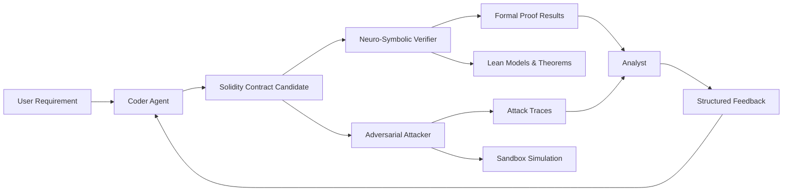

# LeVer: Trustworthy Smart Contract Synthesis with Lean-Based Verification

> Official repository for **"Towards Trustworthy Smart Contract Synthesis: A Multi-Agent Framework with Lean-Based Verification."**

LeVer is a multi-agent framework for generating trustworthy smart contracts from natural-language requirements. It combines LLM-based Solidity synthesis, Lean-based auto-formalization, formal proof search, and adversarial sandbox testing in a closed-loop refinement pipeline.

> **Repository status:** the codebase is currently being cleaned and organized for public release. This repository is first published as a paper-facing open-source placeholder. Implementation, datasets, scripts, and reproducibility instructions will be released progressively.

---

## Why LeVer?

Large language models make smart contract development easier, but generated contracts are difficult to trust. Since smart contracts are immutable after deployment and often directly manage financial assets, even subtle logic errors can cause irreversible losses.

LeVer addresses this trust gap by combining two complementary assurance mechanisms:

1. **Formal verification with Lean 4** - selected safety properties are translated into Lean theorems and checked by the Lean compiler.
2. **Adversarial dynamic testing** - an attacker agent searches for concrete exploit traces in a sandbox environment, especially for properties that are hard to prove statically.

Together, these components allow contracts to be generated, verified, attacked, repaired, and re-verified in an iterative loop.

---

## Framework Overview



At a high level, LeVer consists of four roles:

| Component | Role |
|---|---|
| **Coder Agent** | Generates Solidity contracts from requirements and repairs them using verifier/attacker feedback. |
| **Verifier Agent** | Extracts safety properties, auto-formalizes Solidity logic into Lean, and attempts to prove theorems. |
| **Attacker Agent** | Simulates adversarial transaction sequences to discover concrete exploits and counterexamples. |
| **Analyst** | Converts failed proofs and attack traces into structured repair feedback and new formal properties. |

---

## Key Features

- **Closed-loop synthesis and repair**: generated contracts are repeatedly refined using proof failures and attack traces.
- **Lean-based auto-formalization**: Solidity storage, execution context, inputs, and transition logic are modeled as functional Lean definitions.
- **Property-driven security assurance**: vulnerabilities are addressed through safety invariants rather than only pattern matching.
- **Attack-to-property refinement**: concrete exploits found by the attacker are distilled into new formal properties for future verification.
- **Dual assurance**: formal proofs provide mathematical guarantees for selected properties, while dynamic attacks improve empirical robustness.

---

## Current Release Status

This repository is under active preparation. The following table summarizes the planned release items.

| Module | Status | Description |
|---|---:|---|
| Paper-facing README | ✅ Available | Overview of the method and repository roadmap. |
| Core orchestration | 🚧 Cleaning | Multi-agent loop for generation, verification, attack, and repair. |
| Coder agent | 🚧 Cleaning | Solidity synthesis and feedback-based refinement. |
| Lean formalizer | 🚧 Cleaning | Solidity-to-Lean semantic translation templates. |
| Lean prover interface | 🚧 Cleaning | Proof generation, compiler feedback parsing, and retry logic. |
| Attacker sandbox | 🚧 Cleaning | Adversarial transaction simulation and runtime property oracles. |
| Benchmark scripts | 🚧 Cleaning | Scripts for reproducing the main experimental results. |
| Datasets / prompts | 🚧 Cleaning | Prompt templates, property libraries, and benchmark metadata. |
| Documentation | 🚧 Cleaning | Installation, API usage, examples, and reproduction guide. |

---

## Planned Repository Structure

The final repository may be organized as follows:

```text
LeVer/
├── README.md
├── LICENSE
├── requirements.txt / pyproject.toml
├── configs/
│   ├── models.yaml
│   ├── verifier.yaml
│   └── attacker.yaml
├── lever/
│   ├── agents/
│   │   ├── coder.py
│   │   ├── verifier.py
│   │   ├── attacker.py
│   │   └── analyst.py
│   ├── formalization/
│   │   ├── solidity_to_lean.py
│   │   ├── templates/
│   │   └── properties/
│   ├── sandbox/
│   │   ├── simulator.py
│   │   ├── oracle.py
│   │   └── attacks/
│   └── utils/
├── examples/
│   ├── requirements/
│   ├── contracts/
│   └── lean/
├── scripts/
│   ├── run_generation.py
│   ├── run_verification.py
│   ├── run_attack.py
│   └── reproduce_table1.py
├── data/
│   └── README.md
└── docs/
    ├── framework.md
    ├── formalization.md
    └── reproduction.md
```

This structure is subject to change during code cleanup.

---

## Installation

The runnable implementation has not yet been released. Once the code is available, this section will include:

- Python environment setup
- Lean 4 installation instructions
- Solidity / Foundry / Slither dependencies
- Model API configuration
- End-to-end verification and attack-simulation examples

For now, you can clone the repository as a documentation placeholder:

```bash
git clone <repo-url>
cd LeVer
```

---

## Usage Preview

The final interface is still being organized. The intended workflow will look like:

```bash
# 1. Generate a smart contract from a natural-language requirement
lever synthesize --requirement examples/requirements/auction.md --output outputs/auction/

# 2. Translate the contract into Lean models and verify selected properties
lever verify --contract outputs/auction/contract.sol --properties configs/properties.yaml

# 3. Run adversarial sandbox testing
lever attack --contract outputs/auction/contract.sol --scenario examples/scenarios/auction.yaml

# 4. Run the closed-loop refinement pipeline
lever run --requirement examples/requirements/auction.md --rounds 5
```

> The commands above describe the planned user experience and may change in the official code release.

---

## Reproducing Paper Results

The paper evaluates LeVer on a large-scale smart contract generation benchmark and compares it with direct LLM generation and FSM-guided generation across multiple backbone models.

The reproduction package will include:

- benchmark preprocessing scripts;
- prompt templates for all agents;
- property selection and formalization templates;
- Lean verification scripts;
- adversarial sandbox scenarios;
- scripts for standard correctness checks using tools such as Slither and Foundry;
- scripts for computing verification rate, average verified properties, attack success rate, and audit pass rate.

A detailed reproduction guide will be added in `docs/reproduction.md`.

---

## Method Summary

LeVer formulates trustworthy smart contract synthesis as a property satisfaction problem. Given a natural-language requirement, the system tries to generate a contract and a set of safety properties such that the contract can be formally verified against those properties.

The verification side models contract execution as state transitions:

```text
State x Context x Input -> Result
```

In this model:

- contract storage is represented as an immutable Lean state structure;
- blockchain variables such as `msg.sender` and `block.timestamp` are represented as explicit context fields;
- Solidity `require` statements are translated into guard conditions;
- storage updates are translated into functional record or lambda updates;
- transaction reverts are represented as failure branches.

The attacker side complements formal verification by searching for concrete exploit traces in an adversarial environment. When an exploit is found, the trace is converted into feedback for contract repair and may also be distilled into a new formal property.

---

## Roadmap

- [ ] Release cleaned core framework code
- [ ] Release Lean formalization templates
- [ ] Release property library and prompt templates
- [ ] Release adversarial sandbox and runtime oracles
- [ ] Add runnable examples for representative smart contracts
- [ ] Add benchmark reproduction scripts
- [ ] Add detailed documentation for extending LeVer with new properties
- [ ] Add CI checks for Solidity tests and Lean verification examples

---

## Citation

If you find this work useful, please cite:

```bibtex
@misc{lever2026,
  title        = {Towards Trustworthy Smart Contract Synthesis: A Multi-Agent Framework with Lean-Based Verification},
  author       = {Anonymous},
  year         = {2026},
  note         = {Under review}
}
```

The citation will be updated after publication.

---

## Security Notice

LeVer is a research prototype. Generated or verified smart contracts should **not** be deployed with real funds without independent review, testing, and professional security auditing.

---

## License

The open-source license will be added before the official code release. Suggested options include:

- MIT or Apache-2.0 for framework code;
- CC BY 4.0 or a dataset-specific license for documentation and released benchmark artifacts.

Please update this section according to the final release policy.

---

## Contact

For questions, please open a GitHub issue after the repository is public.

